# Benefits Assistant Journey, Configuration & Workflow Blueprint

> Current-state product/UX reference and proposed corporate configuration model. Repository baseline: 10 August 2026.

> Source: `Benefits-Assistant-Journey-Workflow-Blueprint.docx`

> **Repository baseline Verified against the EB+Claims workspace as of 10 August 2026. Existing behavior, conceptual future configuration, and identified gaps are explicitly labelled.**

| Artifact | Value |
| --- | --- |
| Audience | Product, UX, engineering, operations, HR and corporate administrators |
| Orientation | US Letter portrait only; 1-inch margins |
| Status | Implementation blueprint — no application code or APIs changed |
| Version | 1.0 \| 10 August 2026 |

Pine green • Mint • Cream • Editable Word workflows

# Contents

Select a section to jump to it. Flowcharts are native Word drawing objects and remain editable.

- [1. Executive summary & scope](#1-executive-summary-and-scope)
- [2. Master assistant journey](#2-master-assistant-journey)
- [3. Quick-chat and guided workflows](#3-quick-chat-and-guided-workflows)
- [4. Use-case coverage matrices](#4-use-case-coverage-matrices)
- [5. Corporate configuration specification](#5-corporate-configuration-specification)
- [6. Canonical claim lifecycle](#6-canonical-claim-lifecycle)
- [7. Corporate profiles & validation examples](#7-corporate-profiles-and-validation-examples)
- [8. Current-state gaps & improvement backlog](#8-current-state-gaps-and-improvement-backlog)
- [9. Conceptual interfaces & implementation notes](#9-conceptual-interfaces-and-implementation-notes)
- [10. Verification checklist](#10-verification-checklist)
## Legend

| Visual | Meaning |
| --- | --- |
| Mint | Success, approved state, or validated outcome |
| Cream | Employee or assistant action |
| Amber diamond | Decision or configurable gate |
| Soft red | Blocked, rejected, or recovery path |
| Blue | Downstream screen or operational handoff |
| [CURRENT] | Behavior verified in repository code or deterministic demo |
| [PROPOSED] | Recommended configuration/lifecycle behavior not yet implemented |
| [GAP] | Observed difference between intended capability and reachable behavior |

# 1. Executive summary & scope

The Benefits Assistant combines five visible quick chats with additional guided workflows, free-text routing, local persistence, and downstream screen handoffs. Its strongest current behavior is the deterministic, structured benefit-claim demo: the assistant turns a selected bill scenario into editable details, policy checks, warnings and a submission receipt. Vehicle and driver registration are also guided, structured journeys.

> **Blueprint decision Use the repository as the source of truth for current journeys. Treat corporate configuration, automated reimbursement, and the canonical reimbursement lifecycle as a proposed product contract until backed by services and persisted state.**

## Scope

- Five visible quick chats: Upload bill, Claim history, Meals merchant, View dashboard and View policy.
- Guided and free-text routes: Track/edit claim, Vehicle Registration, Driver Salary, grounded policy/app-data answers, fallback, persistence and privacy.
- Seven benefit categories, twelve bill scenarios, two driving-licence outcomes, policy questions, claim filters, merchant paths, persona differences, error states and handoffs.
- Corporate configurability only for Bill Upload, Driver Salary and Vehicle Registration.
- User-facing claim lifecycle from upload through reimbursement, including recovery and payment-failure states.
## Out of scope

This artifact does not change TypeScript, APIs, database schemas, corporate policy, payment rails, HR queues or production OCR/verification services. Interface names in section 9 are conceptual contracts for future implementation.

## Repository evidence

| Evidence area | Verified source / observation |
| --- | --- |
| Quick chats | features/chat/constants.ts defines the five visible actions. |
| Routing and guided flows | features/chat/useChat.ts handles quick actions, free text, registration, claim edit, grounding and persistence. |
| Bill scenarios | features/chat/demoUploadScenarios.ts defines 12 deterministic scenarios. |
| Benefits & policies | Claim, policy, dashboard and history constants provide the seven categories, balances, status views and policy copy. |
| Screenshots | Six deterministic local demo journeys captured from http://127.0.0.1:3000 on 10 August 2026. |

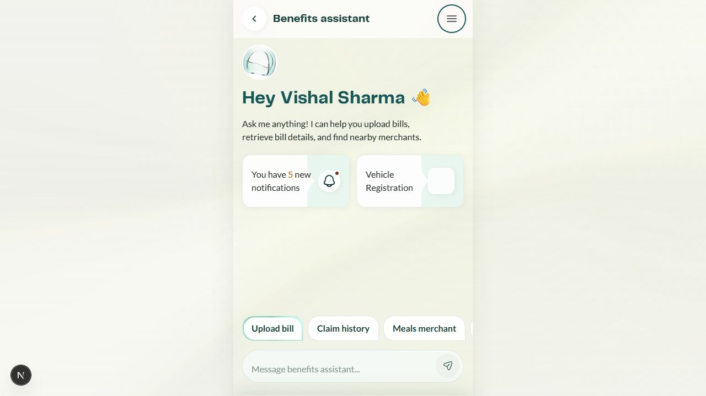

*Figure 1 — Assistant entry and visible quick chats*

# 2. Master assistant journey

The master journey separates reachable current behavior from proposed operational processing. Every route ends in a structured assistant outcome, a downstream screen, an employee recovery action, or a safe fallback.

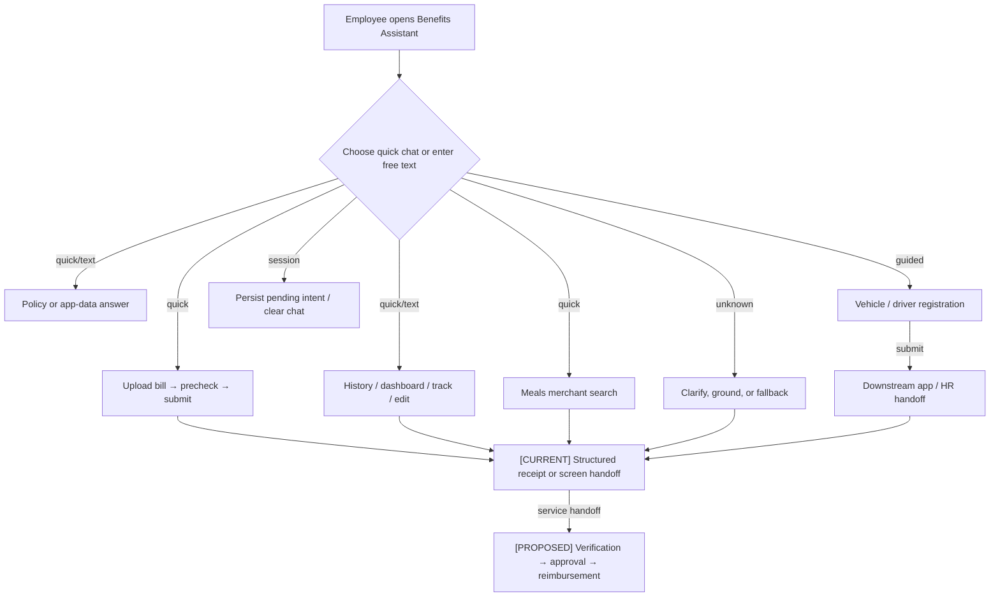
```mermaid
flowchart TD
    c1n0["Employee opens Benefits Assistant"]
    c1n1{"Choose quick chat or enter free text"}
    c1n2["Upload bill → precheck → submit"]
    c1n3["History / dashboard / track / edit"]
    c1n4["Policy or app-data answer"]
    c1n5["Vehicle / driver registration"]
    c1n6["Meals merchant search"]
    c1n7["Clarify, ground, or fallback"]
    c1n8["Persist pending intent / clear chat"]
    c1n9["Downstream app / HR handoff"]
    c1n10["[CURRENT] Structured receipt or screen handoff"]
    c1n11["[PROPOSED] Verification → approval → reimbursement"]
    c1n0 --> c1n1
    c1n1 -->|quick| c1n2
    c1n1 -->|quick/text| c1n3
    c1n1 -->|quick/text| c1n4
    c1n1 -->|guided| c1n5
    c1n1 -->|quick| c1n6
    c1n1 -->|unknown| c1n7
    c1n1 -->|session| c1n8
    c1n5 -->|submit| c1n9
    c1n2 --> c1n10
    c1n3 --> c1n10
    c1n6 --> c1n10
    c1n7 --> c1n10
    c1n9 --> c1n10
    c1n10 -->|service handoff| c1n11
    classDef current fill:#F4F6F7,stroke:#005656,color:#123F36;
    classDef proposed fill:#FFF1CC,stroke:#C15C1A,color:#123F36;
```

*Master editable flow — current application reach ends at structured outcomes and handoffs; the reimbursement lifecycle is a proposed cross-service contract.*

## Routing rules

| Entry | Resolution | Fallback / handoff |
| --- | --- | --- |
| Visible quick chat | Deterministic handler and structured card | Action-specific recovery or downstream screen |
| Recognized free text | Intent handler for claim, policy, merchant, vehicle or driver | Pending intent requests missing detail |
| Grounded policy/app-data question | Repository-backed answer; model may rewrite with grounding | Deterministic fallback if model unavailable |
| Unknown / ambiguous message | Ask a clarifying question or present available actions | Preserve draft until user clears conversation |

# 3. Quick-chat and guided workflows

Each chart summarizes the reachable current branch structure and marks proposed configuration gates where applicable. Detailed scenarios and exceptions follow in the coverage matrices.

## 3.1 Upload bill

[CURRENT] All three source options open the deterministic scenario picker. [PROPOSED] Production sources should feed OCR/extraction and corporate-configured verification gates.

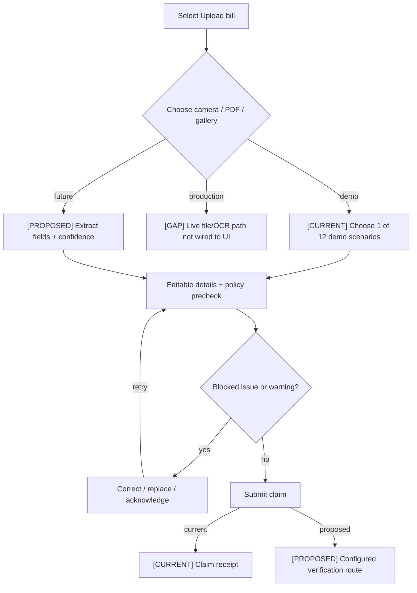
```mermaid
flowchart TD
    c2n0["Select Upload bill"]
    c2n1{"Choose camera / PDF / gallery"}
    c2n2["[CURRENT] Choose 1 of 12 demo scenarios"]
    c2n3["[GAP] Live file/OCR path not wired to UI"]
    c2n4["[PROPOSED] Extract fields + confidence"]
    c2n5["Editable details + policy precheck"]
    c2n6{"Blocked issue or warning?"}
    c2n7["Correct / replace / acknowledge"]
    c2n8["Submit claim"]
    c2n9["[PROPOSED] Configured verification route"]
    c2n10["[CURRENT] Claim receipt"]
    c2n0 --> c2n1
    c2n1 -->|demo| c2n2
    c2n1 -->|production| c2n3
    c2n1 -->|future| c2n4
    c2n2 --> c2n5
    c2n4 --> c2n5
    c2n5 --> c2n6
    c2n6 -->|yes| c2n7
    c2n6 -->|no| c2n8
    c2n7 -->|retry| c2n5
    c2n8 -->|current| c2n10
    c2n8 -->|proposed| c2n9
    classDef current fill:#F4F6F7,stroke:#005656,color:#123F36;
    classDef proposed fill:#FFF1CC,stroke:#C15C1A,color:#123F36;
```

*Editable workflow — each node and connector is a native Word drawing object.*

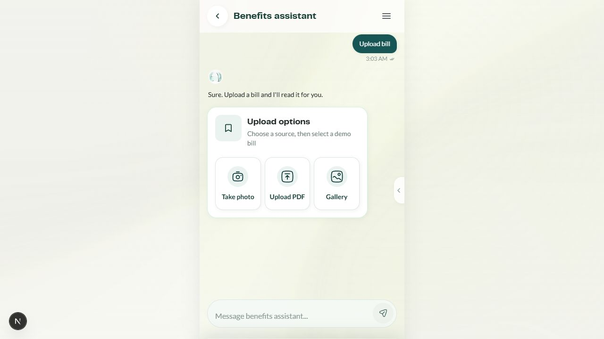

*Figure 2 — Bill upload source selection*

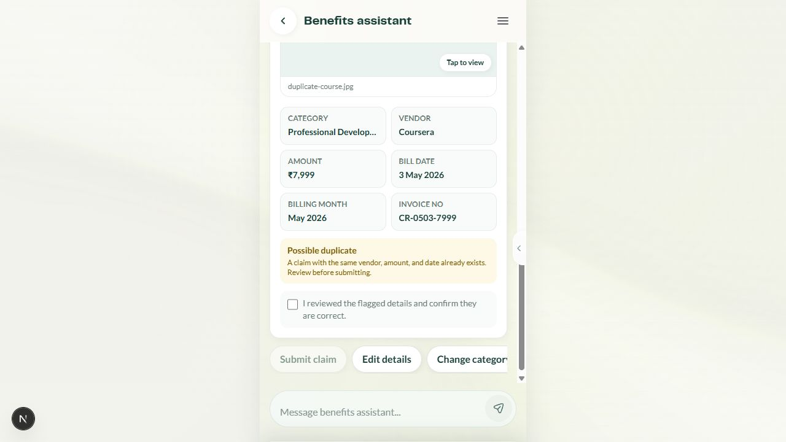

*Figure 3 — Duplicate warning and acknowledgement gate*

## 3.2 Claim history

[CURRENT] Presents claim history and benefit/status filters, with cards that can hand off to claim detail.

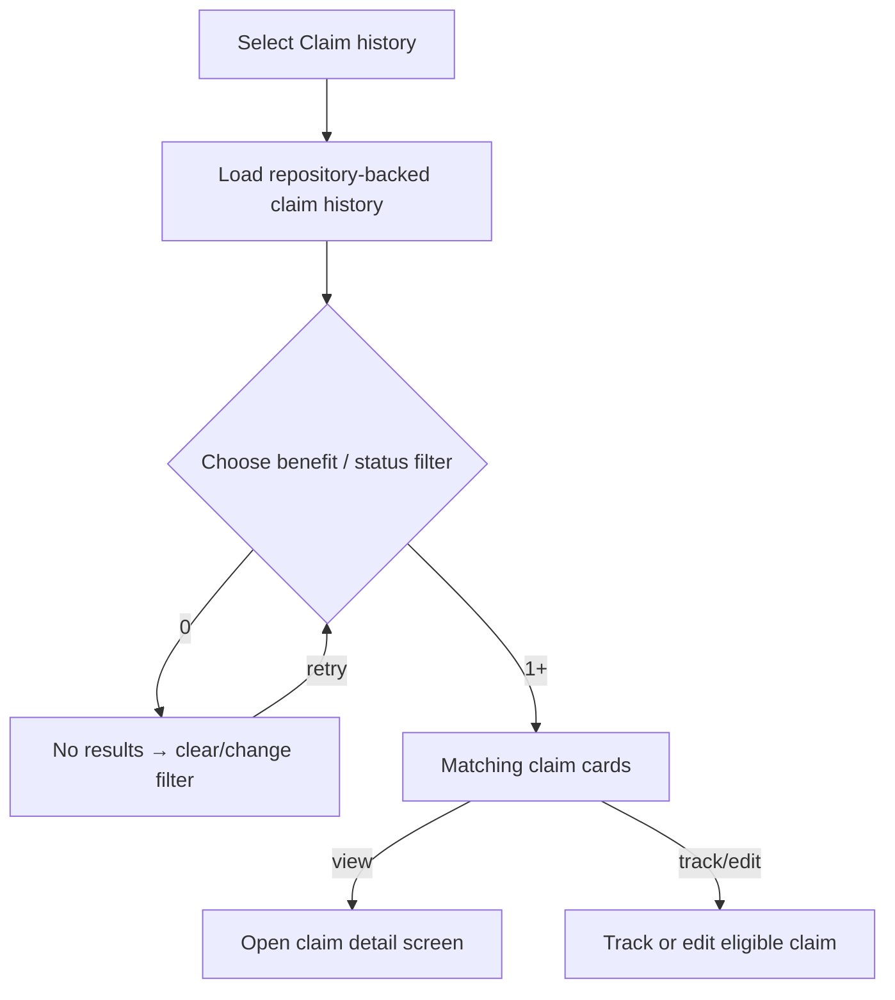
```mermaid
flowchart TD
    c3n0["Select Claim history"]
    c3n1["Load repository-backed claim history"]
    c3n2{"Choose benefit / status filter"}
    c3n3["No results → clear/change filter"]
    c3n4["Matching claim cards"]
    c3n5["Open claim detail screen"]
    c3n6["Track or edit eligible claim"]
    c3n0 --> c3n1
    c3n1 --> c3n2
    c3n2 -->|0| c3n3
    c3n2 -->|1+| c3n4
    c3n4 -->|view| c3n5
    c3n4 -->|track/edit| c3n6
    c3n3 -->|retry| c3n2
    classDef current fill:#F4F6F7,stroke:#005656,color:#123F36;
    classDef proposed fill:#FFF1CC,stroke:#C15C1A,color:#123F36;
```

*Editable workflow — each node and connector is a native Word drawing object.*

## 3.3 Meals merchant

[CURRENT] The visible quick chat is fixed to Meals. It supports merchant-name lookup and a nearby-search branch; results communicate allowed/not allowed status.

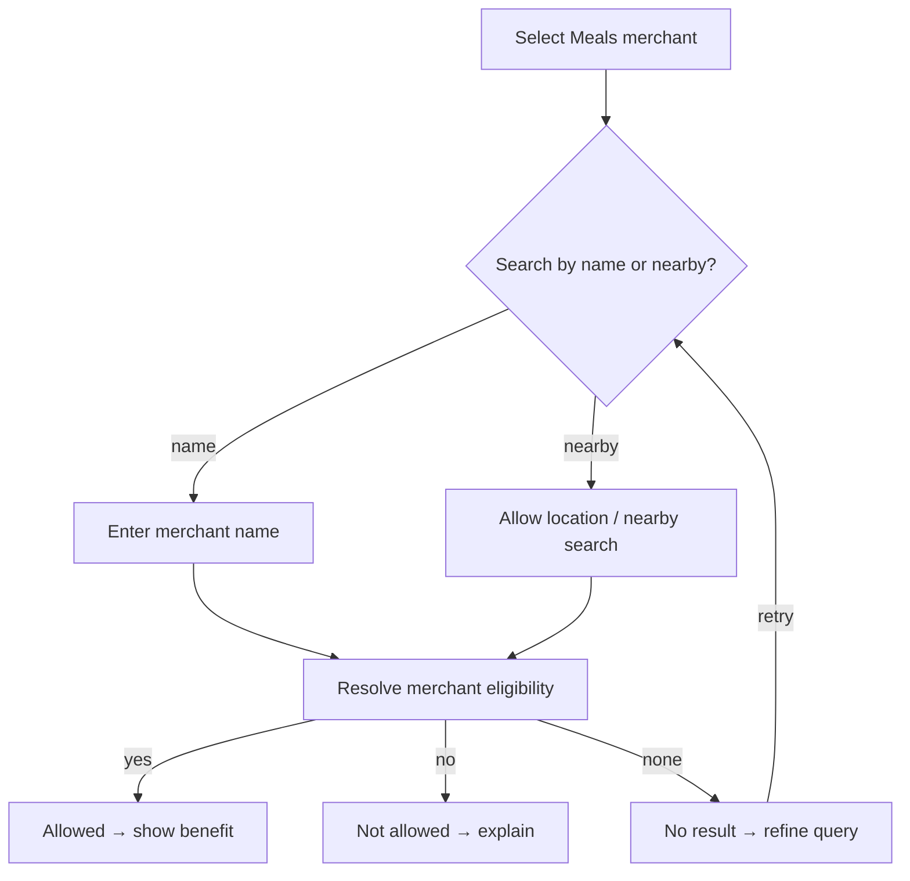
```mermaid
flowchart TD
    c4n0["Select Meals merchant"]
    c4n1{"Search by name or nearby?"}
    c4n2["Enter merchant name"]
    c4n3["Allow location / nearby search"]
    c4n4["Resolve merchant eligibility"]
    c4n5["Allowed → show benefit"]
    c4n6["Not allowed → explain"]
    c4n7["No result → refine query"]
    c4n0 --> c4n1
    c4n1 -->|name| c4n2
    c4n1 -->|nearby| c4n3
    c4n2 --> c4n4
    c4n3 --> c4n4
    c4n4 -->|yes| c4n5
    c4n4 -->|no| c4n6
    c4n4 -->|none| c4n7
    c4n7 -->|retry| c4n1
    classDef current fill:#F4F6F7,stroke:#005656,color:#123F36;
    classDef proposed fill:#FFF1CC,stroke:#C15C1A,color:#123F36;
```

*Editable workflow — each node and connector is a native Word drawing object.*

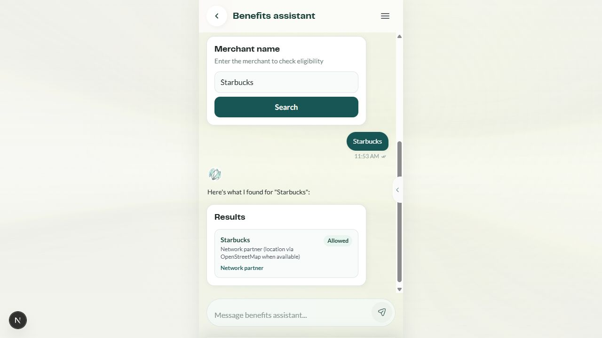

*Figure 4 — Structured merchant eligibility result*

## 3.4 View dashboard

[CURRENT] Provides a structured summary and hands off to the Claims Dashboard screen for deeper analysis.

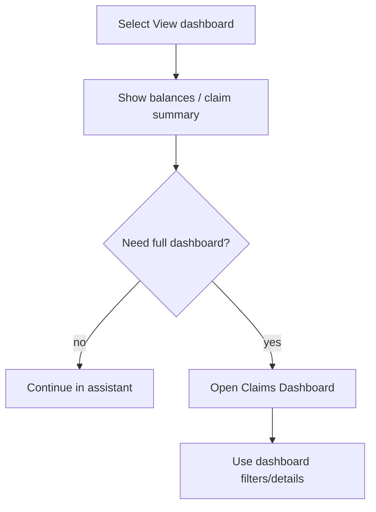
```mermaid
flowchart TD
    c5n0["Select View dashboard"]
    c5n1["Show balances / claim summary"]
    c5n2{"Need full dashboard?"}
    c5n3["Continue in assistant"]
    c5n4["Open Claims Dashboard"]
    c5n5["Use dashboard filters/details"]
    c5n0 --> c5n1
    c5n1 --> c5n2
    c5n2 -->|no| c5n3
    c5n2 -->|yes| c5n4
    c5n4 --> c5n5
    classDef current fill:#F4F6F7,stroke:#005656,color:#123F36;
    classDef proposed fill:#FFF1CC,stroke:#C15C1A,color:#123F36;
```

*Editable workflow — each node and connector is a native Word drawing object.*

## 3.5 View policy

[CURRENT] Lets the user choose a benefit and asks/answers policy questions using grounded repository content, with deterministic fallback when model output is unavailable.

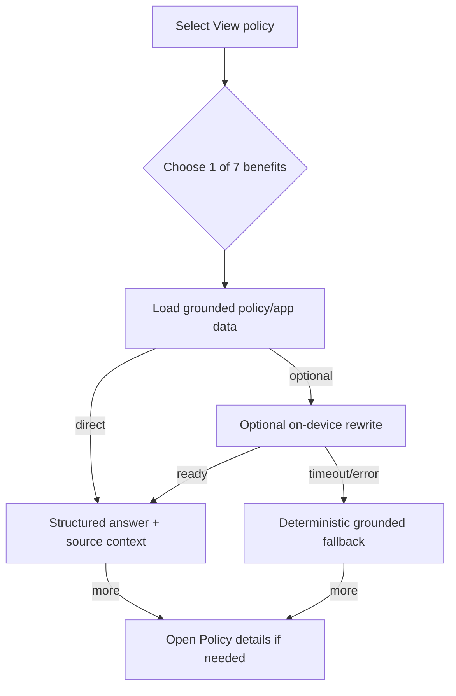
```mermaid
flowchart TD
    c6n0["Select View policy"]
    c6n1{"Choose 1 of 7 benefits"}
    c6n2["Load grounded policy/app data"]
    c6n3["Optional on-device rewrite"]
    c6n4["Structured answer + source context"]
    c6n5["Deterministic grounded fallback"]
    c6n6["Open Policy details if needed"]
    c6n0 --> c6n1
    c6n1 --> c6n2
    c6n2 -->|optional| c6n3
    c6n2 -->|direct| c6n4
    c6n3 -->|ready| c6n4
    c6n3 -->|timeout/error| c6n5
    c6n4 -->|more| c6n6
    c6n5 -->|more| c6n6
    classDef current fill:#F4F6F7,stroke:#005656,color:#123F36;
    classDef proposed fill:#FFF1CC,stroke:#C15C1A,color:#123F36;
```

*Editable workflow — each node and connector is a native Word drawing object.*

## 3.6 Track and edit claim

[CURRENT] Track uses a canned claim response and edit collects claim/date intent before showing editable details. [GAP] Track does not yet bind to the user-entered claim identifier.

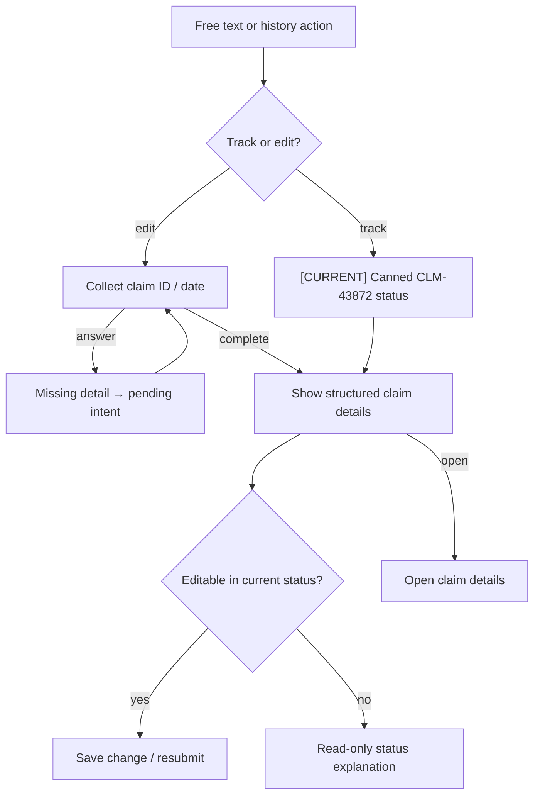
```mermaid
flowchart TD
    c7n0["Free text or history action"]
    c7n1{"Track or edit?"}
    c7n2["[CURRENT] Canned CLM-43872 status"]
    c7n3["Collect claim ID / date"]
    c7n4["Missing detail → pending intent"]
    c7n5["Show structured claim details"]
    c7n6{"Editable in current status?"}
    c7n7["Save change / resubmit"]
    c7n8["Read-only status explanation"]
    c7n9["Open claim details"]
    c7n0 --> c7n1
    c7n1 -->|track| c7n2
    c7n1 -->|edit| c7n3
    c7n3 -->|answer| c7n4
    c7n4 --> c7n3
    c7n3 -->|complete| c7n5
    c7n2 --> c7n5
    c7n5 --> c7n6
    c7n6 -->|yes| c7n7
    c7n6 -->|no| c7n8
    c7n5 -->|open| c7n9
    classDef current fill:#F4F6F7,stroke:#005656,color:#123F36;
    classDef proposed fill:#FFF1CC,stroke:#C15C1A,color:#123F36;
```

*Editable workflow — each node and connector is a native Word drawing object.*

## 3.7 Vehicle registration

[CURRENT] A guided vehicle lookup, ownership confirmation, review/declaration and HR submission. [PROPOSED] Corporate settings govern eligibility, change limits, documents and verification.

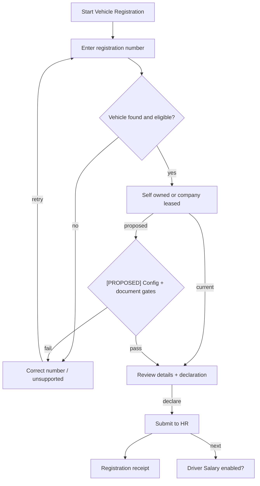
```mermaid
flowchart TD
    c8n0["Start Vehicle Registration"]
    c8n1["Enter registration number"]
    c8n2{"Vehicle found and eligible?"}
    c8n3["Correct number / unsupported"]
    c8n4["Self owned or company leased"]
    c8n5{"[PROPOSED] Config + document gates"}
    c8n6["Review details + declaration"]
    c8n7["Submit to HR"]
    c8n8["Registration receipt"]
    c8n9["Driver Salary enabled?"]
    c8n0 --> c8n1
    c8n1 --> c8n2
    c8n2 -->|no| c8n3
    c8n2 -->|yes| c8n4
    c8n3 -->|retry| c8n1
    c8n4 -->|proposed| c8n5
    c8n4 -->|current| c8n6
    c8n5 -->|pass| c8n6
    c8n5 -->|fail| c8n3
    c8n6 -->|declare| c8n7
    c8n7 --> c8n8
    c8n7 -->|next| c8n9
    classDef current fill:#F4F6F7,stroke:#005656,color:#123F36;
    classDef proposed fill:#FFF1CC,stroke:#C15C1A,color:#123F36;
```

*Editable workflow — each node and connector is a native Word drawing object.*

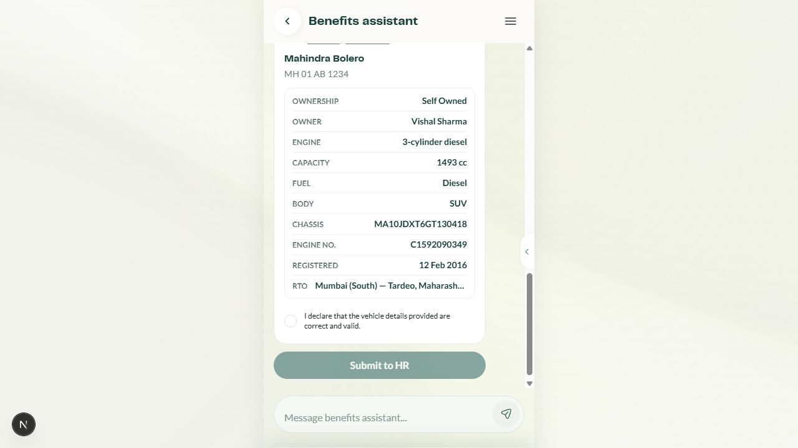

*Figure 5 — Vehicle registration review and HR handoff*

## 3.8 Driver registration and Driver Salary

[CURRENT] Begins after vehicle submission or direct intent, captures driver name, chooses a DL outcome, confirms licence data and continues to salary details. [PROPOSED] Corporate settings govern prerequisites, limits, proof and processing.

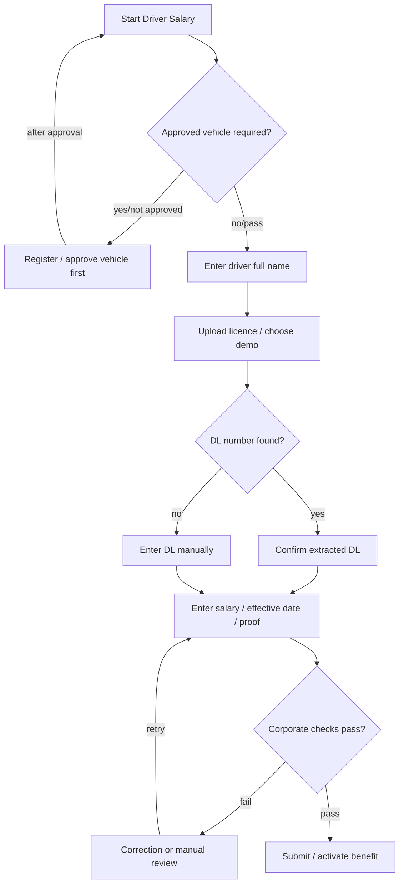
```mermaid
flowchart TD
    c9n0["Start Driver Salary"]
    c9n1{"Approved vehicle required?"}
    c9n2["Register / approve vehicle first"]
    c9n3["Enter driver full name"]
    c9n4["Upload licence / choose demo"]
    c9n5{"DL number found?"}
    c9n6["Confirm extracted DL"]
    c9n7["Enter DL manually"]
    c9n8["Enter salary / effective date / proof"]
    c9n9{"Corporate checks pass?"}
    c9n10["Correction or manual review"]
    c9n11["Submit / activate benefit"]
    c9n0 --> c9n1
    c9n1 -->|yes/not approved| c9n2
    c9n1 -->|no/pass| c9n3
    c9n2 -->|after approval| c9n0
    c9n3 --> c9n4
    c9n4 --> c9n5
    c9n5 -->|yes| c9n6
    c9n5 -->|no| c9n7
    c9n6 --> c9n8
    c9n7 --> c9n8
    c9n8 --> c9n9
    c9n9 -->|fail| c9n10
    c9n9 -->|pass| c9n11
    c9n10 -->|retry| c9n8
    classDef current fill:#F4F6F7,stroke:#005656,color:#123F36;
    classDef proposed fill:#FFF1CC,stroke:#C15C1A,color:#123F36;
```

*Editable workflow — each node and connector is a native Word drawing object.*

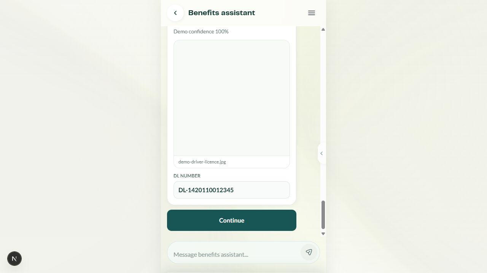

*Figure 6 — Driver Salary DL extraction outcome*

## 3.9 Grounded policy/app-data routing and fallback

[CURRENT] Recognized questions use repository-backed facts. Optional model generation may refine phrasing; deterministic answers remain the safe fallback.

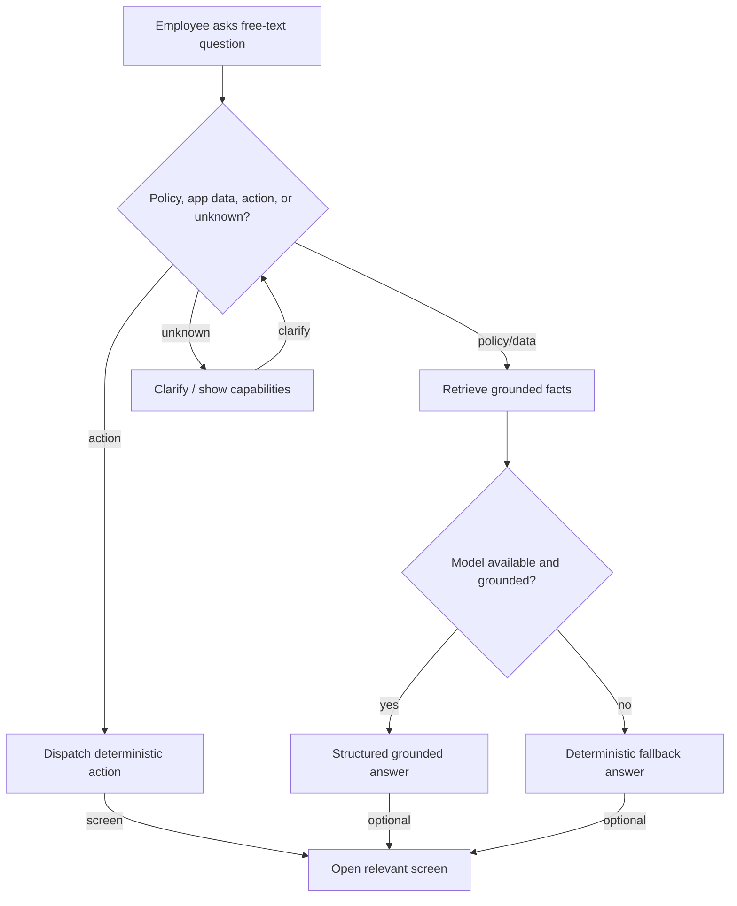
```mermaid
flowchart TD
    c10n0["Employee asks free-text question"]
    c10n1{"Policy, app data, action, or unknown?"}
    c10n2["Retrieve grounded facts"]
    c10n3["Dispatch deterministic action"]
    c10n4["Clarify / show capabilities"]
    c10n5{"Model available and grounded?"}
    c10n6["Structured grounded answer"]
    c10n7["Deterministic fallback answer"]
    c10n8["Open relevant screen"]
    c10n0 --> c10n1
    c10n1 -->|policy/data| c10n2
    c10n1 -->|action| c10n3
    c10n1 -->|unknown| c10n4
    c10n2 --> c10n5
    c10n5 -->|yes| c10n6
    c10n5 -->|no| c10n7
    c10n3 -->|screen| c10n8
    c10n6 -->|optional| c10n8
    c10n7 -->|optional| c10n8
    c10n4 -->|clarify| c10n1
    classDef current fill:#F4F6F7,stroke:#005656,color:#123F36;
    classDef proposed fill:#FFF1CC,stroke:#C15C1A,color:#123F36;
```

*Editable workflow — each node and connector is a native Word drawing object.*

## 3.10 Chat persistence, pending intents, privacy and clearing

[CURRENT] Chat and structured claim details are stored in the browser; pending intents keep incomplete journeys resumable. Clearing removes browser-saved conversation data, while original files/raw OCR are not retained by this demo.

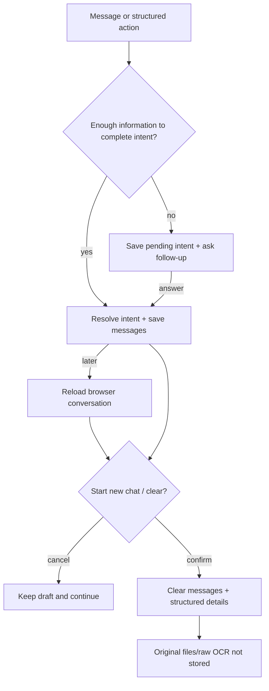
```mermaid
flowchart TD
    c11n0["Message or structured action"]
    c11n1{"Enough information to complete intent?"}
    c11n2["Save pending intent + ask follow-up"]
    c11n3["Resolve intent + save messages"]
    c11n4["Reload browser conversation"]
    c11n5{"Start new chat / clear?"}
    c11n6["Keep draft and continue"]
    c11n7["Clear messages + structured details"]
    c11n8["Original files/raw OCR not stored"]
    c11n0 --> c11n1
    c11n1 -->|no| c11n2
    c11n1 -->|yes| c11n3
    c11n2 -->|answer| c11n3
    c11n3 -->|later| c11n4
    c11n4 --> c11n5
    c11n3 --> c11n5
    c11n5 -->|cancel| c11n6
    c11n5 -->|confirm| c11n7
    c11n7 --> c11n8
    classDef current fill:#F4F6F7,stroke:#005656,color:#123F36;
    classDef proposed fill:#FFF1CC,stroke:#C15C1A,color:#123F36;
```

*Editable workflow — each node and connector is a native Word drawing object.*

# 4. Use-case coverage matrices

## 4.1 Seven benefits

| Benefit | Bill / policy coverage | Assistant behavior | Key exception |
| --- | --- | --- | --- |
| Meal | Meal receipt; merchant eligibility | Precheck, merchant search, policy answer | Missing amount/date; merchant not eligible |
| Fuel & Maintenance | Fuel receipt; vehicle dependency | Precheck and policy routing | Allowance overrun; vehicle not registered |
| Internet | Broadband invoice | Structured extraction and precheck | Unsupported proof or period |
| Mobile | Postpaid mobile invoice | Structured extraction and precheck | Line/employee mismatch |
| Gift | Gift purchase | Structured extraction and precheck | Category or merchant restriction |
| Books & Periodicals | Professional book invoice | Structured extraction and precheck | Non-professional item |
| Professional Development | Role-related course invoice | Structured extraction and precheck | HR review / category ambiguity |

## 4.2 Twelve bill scenarios

| Scenario | Expected precheck | Employee branch | Current outcome |
| --- | --- | --- | --- |
| Meal Bill | All standard checks pass | Review → submit | Receipt |
| Meal Bill — missing data | Amount/date incomplete | Edit missing fields | Returns to precheck |
| Fuel Bill | Policy/category match | Review → submit | Receipt |
| Fuel Bill — exceeding balance | Amount > available allowance | Correct or stop | Submission blocked |
| Internet Bill | Required invoice fields | Review → submit | Receipt |
| Mobile Postpaid Bill | Required invoice fields | Review → submit | Receipt |
| Gift Bill | Category/amount checks | Review → submit | Receipt |
| Books & Periodicals | Professional category match | Review → submit | Receipt |
| Professional Development | Role-related category | Review / HR path | Receipt or review |
| Duplicate Bill | Duplicate warning | Acknowledge warning | Submit enabled after acknowledgement |
| Late Bill | Submission-window warning/block | Acknowledge or stop per rule | Configured/current scenario result |
| Other / HR Review | No direct category match | Accept HR review | Manual-review route |

## 4.3 DL outcomes, policy questions and claims

| Area | Covered variants | Resolution |
| --- | --- | --- |
| Driving licence | DL found; DL data not found | Confirm extracted number or enter manually; continue to salary details. |
| Policy questions | Eligibility, allowance, deadline, proof, category and process questions across benefits | Grounded app/policy content; optional model rewrite; deterministic fallback. |
| Claim filters | Benefit/category and status views | Filter history; empty state returns to filter; card opens detail. |
| Claim tracking | Track status and open details | Current response is canned; proposed route binds actual claim ID. |
| Claim editing | Claim ID/date collection and editable details | Pending intent collects missing identifiers; save/resubmit only when eligible. |
| Merchant search | By name; nearby; allowed/not allowed/no result | Structured eligibility answer and query refinement. |

## 4.4 Personas, errors and handoffs

| Dimension | Current variants | Product implication |
| --- | --- | --- |
| Persona | Persona system changes user context; vehicle lookup displays a hard-coded Vishal Sharma owner. | Remove hard-coded name and bind all identity copy to the active persona. |
| Upload errors | Missing data, allowance overrun, duplicate, late, other/HR review. | Keep every error actionable; distinguish warning acknowledgement from hard block. |
| DL errors | No extracted number. | Manual entry must preserve the uploaded preview and prior driver name. |
| Model errors | On-device preparation may stall or be unavailable. | Time-bound model use and always surface grounded fallback content. |
| Persistence | Browser-saved messages, structured details, pending intents. | Define expiry, version migration and privacy notices for production. |
| Handoffs | Claims Dashboard, policy details, claim details, vehicle details, HR queue. | Carry employee/claim context and return path across screens. |

# 5. Corporate configuration specification

> **Status: PROPOSED These capabilities are a future configuration contract. The current repository demonstrates local guided flows and prechecks; it does not implement a corporate configuration service or automated payout orchestration.**

## 5.1 Resolution model

At runtime, each setting resolves from the most specific eligible source. Missing benefit overrides inherit the corporate default; missing corporate defaults inherit the platform default. A configuration is publishable only after schema validation, dependency validation, sample-journey simulation and an effective-date check.

| Layer | Example | Governance |
| --- | --- | --- |
| Benefit-specific override | Fuel bills: max auto reimbursement ₹8,000 | Corporate admin; requires reason and effective date |
| Corporate default | All benefits: confidence-routed at 90% | Corporate admin; versioned and approved |
| Platform default | Manual review; auto reimbursement off | Platform operator; safest fallback |

## 5.2 Composite automation guardrail

Confidence alone never authorizes reimbursement. Automatic approval/reimbursement is allowed only when every configured guardrail passes:

- Confidence meets the configured threshold.
- Required fields and acceptable proof are present.
- Benefit/category match succeeds.
- Amount is within allowance and the auto-processing cap.
- Deadline, duplicate, merchant, employee eligibility and fraud/risk checks pass.
- No unresolved warning or required employee acknowledgement remains.
Failure behavior Any failed gate routes to correction, replacement upload, manual review or rejection according to corporate configuration. A failed payment gate never removes an already recorded approval.

## 5.3 Bill Upload configuration

Precedence: Benefit-specific override → Corporate default → Platform default. Every evaluated claim/registration records the resolved value, source level, configuration version, timestamp and actor/service.

| Field | Purpose / type | Allowed / default | Validation / dependencies | User behavior / audit |
| --- | --- | --- | --- | --- |
| processing_mode | Select review strategy; enum | manual_only \| confidence_routed \| straight_through; default confidence_routed | straight_through requires automation service; benefit override allowed | Sets routing; log resolved value and actor |
| auto_verification_threshold | Minimum OCR/verification confidence; integer % | 0–100; recommended 90 | Must exceed manual band ceiling | At/above may auto-verify; audit score/model/version |
| manual_review_band | Confidence range for review; integer range | Recommended 60–89 | No overlap with auto threshold | Routes to reviewer; audit band and reason |
| low_confidence_behavior | Below-band action; enum | manual_entry \| replacement_upload \| reject; default manual_entry | Reject only if policy permits | Shows recovery or terminal copy; audit selection |
| automatic_reimbursement_enabled | Permit straight-through payout; boolean | true \| false; default false | Requires processing mode, payout rail and all guardrails | Schedules reimbursement only after composite pass; audit gate results |
| max_auto_reimbursement_amount | Per-claim automation cap; currency | ≥0; default ₹5,000 example | Ignored if auto reimbursement off | Higher amounts route manual; audit amount/currency |
| allowed_sources | Accepted upload channels; set | camera \| pdf \| gallery; default all | At least one source | Hides/disables disallowed sources; audit config change |

## 5.3 Bill Upload configuration — continued 2

| Field | Purpose / type | Allowed / default | Validation / dependencies | User behavior / audit |
| --- | --- | --- | --- | --- |
| allowed_file_formats | Accepted MIME/extensions; set | jpg, jpeg, png, pdf; default all | Must match source capabilities | Rejects unsupported file before processing; audit file metadata |
| allowed_proof_types | Evidence kinds; set | receipt \| tax_invoice \| bank_proof \| other | At least one per benefit | Guides upload copy and proof checks; audit proof classification |
| required_fields | Fields needed to submit; set | merchant, date, amount, category, proof + corporate additions | Field must exist in schema | Missing fields produce Needs attention; audit missing list |
| allowed_categories_merchants | Eligibility lists/rules; set | benefit categories, allow/deny merchant lists | Deny takes precedence; versioned | Mismatch blocks/reviews; audit rule/version |
| submission_window_days | Days after bill date; integer | 0–365; default 30 example | Late policy required | Marks late claims; audit bill/submission dates |
| reimbursement_frequency | Claim cadence; enum/count | per_bill \| weekly \| monthly \| n_per_period | Must align to benefit policy | Controls eligibility and user explanation; audit counter/reset |
| duplicate_policy | Duplicate response; enum | block \| warn_acknowledge \| manual_review; default warn_acknowledge | Duplicate matcher must be enabled | Blocks, warns or routes review; audit match evidence |

## 5.3 Bill Upload configuration — continued 3

| Field | Purpose / type | Allowed / default | Validation / dependencies | User behavior / audit |
| --- | --- | --- | --- | --- |
| allowance_overrun_policy | Over-limit behavior; enum | block \| cap_to_balance \| manual_review | Cap needs employee consent | Shows remaining allowance and next action; audit overrun |
| late_submission_policy | Late response; enum | block \| warn_acknowledge \| manual_review | Uses submission window | Controls Expired vs review path; audit deadline rule |
| manual_approver_levels | Approval chain; array | 1–5 levels; default 1 | Role IDs valid and ordered | Shows owner/SLA; audit each decision |
| escalation_rules_sla | Review deadlines/escalation; duration + rules | hours/days; default 2 business days | Calendar/holiday policy required | Notifies and escalates overdue work; audit timers |
| payout_cadence | Approved-payment schedule; enum | immediate \| daily \| weekly \| payroll_cycle | Payout rail required | Sets Reimbursement scheduled date; audit batch ID |
| notification_policy | Events/channels; object | in_app \| email \| SMS per state | Respect consent and quiet hours | Sends state and action notices; audit delivery |
| risk_fraud_rules | Risk gate; ruleset reference | corporate/platform ruleset ID | Must return pass/review/block | Failed gate prevents automation; audit signals/version |

## 5.4 Driver Salary configuration

Precedence: Benefit-specific override → Corporate default → Platform default. Every evaluated claim/registration records the resolved value, source level, configuration version, timestamp and actor/service.

| Field | Purpose / type | Allowed / default | Validation / dependencies | User behavior / audit |
| --- | --- | --- | --- | --- |
| enabled_employee_groups | Feature + eligibility; boolean/set | enabled + group IDs; default disabled | Groups must exist | Shows/hides journey; audit resolved eligibility |
| approved_vehicle_prerequisite | Require approved vehicle; boolean | true \| false; recommended true | Vehicle module must be enabled | Blocks with vehicle CTA until approved; audit vehicle ID |
| max_active_drivers | Concurrent driver limit; integer | 1–10; default 1 | ≥1 when enabled | Blocks or offers replacement; audit active count |
| driver_change_limit | Replacement/change count; integer | 0–12 per period; default 1 | Reset period required | Shows remaining changes; audit counter |
| driver_change_reset_period | Counter window; enum | financial_year \| calendar_year \| rolling_12_months | Required with limit | Resets change allowance; audit boundary |
| required_driver_details | Mandatory profile fields; set | name, mobile, address, relationship + additions | Fields must be supported | Missing fields → Needs attention; audit field set |
| required_dl_documents | Licence proof requirements; set | front, back, single PDF, expiry | At least one DL proof | Guides upload; audit document hashes/metadata |

## 5.4 Driver Salary configuration — continued 2

| Field | Purpose / type | Allowed / default | Validation / dependencies | User behavior / audit |
| --- | --- | --- | --- | --- |
| payment_proof_requirements | Salary evidence; set | receipt \| bank_transfer \| signed_acknowledgement | At least one if claims enabled | Controls monthly claim completeness; audit proof |
| dl_confidence_threshold | Auto-verification threshold; integer % | 0–100; recommended 90 | Manual fallback required below threshold | Auto-confirms or routes manual; audit score/model |
| dl_low_confidence_fallback | Below-threshold behavior; enum | manual_entry \| manual_review \| replacement_upload | Manual review role required if selected | Preserves progress and requests action; audit reason |
| monthly_salary_cap | Eligible monthly maximum; currency | >0; corporate default | Must match benefit allowance | Blocks/caps/reviews excess by policy; audit amount |
| claim_frequency | Salary claim cadence; enum | monthly \| payroll_cycle \| n_per_period | Cutoff required | Controls available claim periods; audit period |
| effective_date_rules | Start-date policy; rules | approval_date \| next_month \| chosen_date | Cannot predate employee eligibility | Explains when benefit starts; audit date resolution |
| retroactive_period_days | Backdated eligibility; integer | 0–365; default 0 | Requires proof and corporate permission | Allows/blocks past periods; audit dates |

## 5.4 Driver Salary configuration — continued 3

| Field | Purpose / type | Allowed / default | Validation / dependencies | User behavior / audit |
| --- | --- | --- | --- | --- |
| manual_approval_levels | Approval chain; array | 0–5; default 1 | 0 only with auto mode | Routes registration/claims; audit decisions |
| payroll_cutoff_sla | Cutoff + review SLA; schedule | day/time/calendar; example 25th | Timezone and holidays required | Shows next payout window; audit cutoff |
| processing_mode | DL/claim processing; enum | manual_only \| confidence_routed \| auto_verify | Auto requires verification service | Controls verification route; audit resolved mode |
| notification_policy | Events/channels; object | in_app \| email \| SMS | Consent/quiet hours | Notifies activation, info request, claim result; audit delivery |
| deactivation_replacement | Exit/replacement behavior; rules | immediate \| period_end; resubmit yes/no | Open claims must be handled | Preserves history and explains next eligibility; audit reason |

## 5.5 Vehicle Registration configuration

Precedence: Benefit-specific override → Corporate default → Platform default. Every evaluated claim/registration records the resolved value, source level, configuration version, timestamp and actor/service.

| Field | Purpose / type | Allowed / default | Validation / dependencies | User behavior / audit |
| --- | --- | --- | --- | --- |
| enabled | Feature availability; boolean | true \| false; default true example | Corporate scope required | Shows/hides registration; audit change |
| max_active_vehicles | Concurrent vehicles; integer | 1–10; default 1 | ≥1 when enabled | Blocks or offers replacement; audit count |
| vehicle_change_allowance | Changes per period; integer | 1–12; recommended profile-specific | Reset period required | Shows remaining changes and blocks at limit; audit counter |
| change_reset_period | Allowance window; enum | financial_year \| calendar_year \| rolling_12_months | Required with allowance | Resets counter; audit boundary |
| cooling_off_days | Minimum time between changes; integer | 0–365; default 0 | Cannot exceed reset period | Shows next eligible date; audit last change |
| permitted_ownership_types | Allowed ownership; set | self_owned \| company_leased \| family_owned | At least one | Hides/disallows ownership choices; audit resolved rule |
| permitted_vehicle_classes | Eligible classes; set | car \| two_wheeler \| commercial + corporate taxonomy | Taxonomy versioned | Blocks/reviews ineligible class; audit class |

## 5.5 Vehicle Registration configuration — continued 2

| Field | Purpose / type | Allowed / default | Validation / dependencies | User behavior / audit |
| --- | --- | --- | --- | --- |
| permitted_fuel_types | Eligible fuels; set | petrol \| diesel \| CNG \| electric \| hybrid | At least one | Controls benefit/policy eligibility; audit fuel |
| registration_relationships | Name relationship rules; set | employee \| spouse \| parent \| company | Proof map required | Requests relationship proof; audit identity match |
| required_documents | Registration proofs; set | RC \| insurance \| lease_proof \| PUC | Conditional by ownership/fuel/class | Missing proof → correction; audit metadata |
| verification_method | Document/lookup route; enum | automatic \| confidence_routed \| manual; default confidence_routed | Auto service required | Sets verification state and owner; audit response |
| verification_threshold | Confidence threshold; integer % | 0–100; recommended 90 | Used only for confidence routing | Routes auto/manual; audit score/model |
| hr_approval_required | Require HR decision; boolean | true \| false; default true | False needs auto-verification | Shows HR handoff or direct approval; audit decision |
| approval_sla | Registration review SLA; duration | business hours/days; default 2 days | Calendar required | Shows expected completion; audit timer |

## 5.5 Vehicle Registration configuration — continued 3

| Field | Purpose / type | Allowed / default | Validation / dependencies | User behavior / audit |
| --- | --- | --- | --- | --- |
| effective_date_rule | Activation date; enum | submission \| approval \| next_period | Must align to payroll/benefit | Controls when vehicle-dependent benefits unlock; audit date |
| replacement_reason_required | Require reason on change; boolean | true \| false; recommended true | Applies after first registration | Collects reason before replacement; audit text/code |
| driver_salary_requires_approval | Gate Driver Salary; boolean | true \| false; recommended true | Driver Salary feature enabled | Shows Driver Salary only after approval; audit vehicle link |
| deactivation_rejection_correction | Recovery rules; object | deactivate timing, correction window, resubmit/appeal flags | Must define effect on dependent claims | Provides next valid action; audit state/reason |

# 6. Canonical claim lifecycle

> **Status: PROPOSED user-facing contract This normalized lifecycle should sit above internal service states. The current repository uses overlapping labels including Submitted, Policy checked, Under review, Needs info, Approved, Rejected, Revoked and Reimbursed; one quick explanation also uses Paid.**

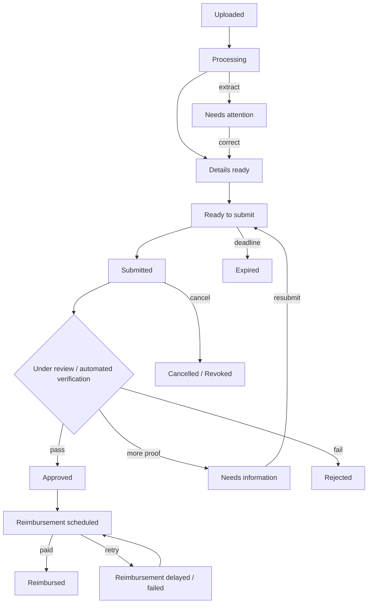
```mermaid
flowchart TD
    c12n0["Uploaded"]
    c12n1["Processing"]
    c12n2["Details ready"]
    c12n3["Ready to submit"]
    c12n4["Submitted"]
    c12n5{"Under review / automated verification"}
    c12n6["Approved"]
    c12n7["Reimbursement scheduled"]
    c12n8["Reimbursed"]
    c12n9["Needs attention"]
    c12n10["Needs information"]
    c12n11["Rejected"]
    c12n12["Reimbursement delayed / failed"]
    c12n13["Expired"]
    c12n14["Cancelled / Revoked"]
    c12n0 --> c12n1
    c12n1 --> c12n2
    c12n2 --> c12n3
    c12n3 --> c12n4
    c12n4 --> c12n5
    c12n5 -->|pass| c12n6
    c12n6 --> c12n7
    c12n7 -->|paid| c12n8
    c12n1 -->|extract| c12n9
    c12n5 -->|more proof| c12n10
    c12n5 -->|fail| c12n11
    c12n7 -->|retry| c12n12
    c12n12 --> c12n7
    c12n9 -->|correct| c12n2
    c12n10 -->|resubmit| c12n3
    c12n3 -->|deadline| c12n13
    c12n4 -->|cancel| c12n14
    classDef current fill:#F4F6F7,stroke:#005656,color:#123F36;
    classDef proposed fill:#FFF1CC,stroke:#C15C1A,color:#123F36;
```

*Canonical lifecycle with actionable recovery loops. Internal technical states may be more granular but must map to exactly one user-facing state.*

## 6.1 State specification

| State | Meaning / entry | Employee / owner | Notification / next states | Class / config impact |
| --- | --- | --- | --- | --- |
| Uploaded | File accepted Entry: Source passes file checks | Action: Wait/remove Owner: System | Notify: In-app Next: Processing, Cancelled | Transient Config: Source/format limits |
| Processing | Extracting/checking Entry: Processing starts | Action: Wait Owner: System | Notify: Progress/error Next: Details ready, Needs attention | Transient Config: Mode, confidence bands |
| Details ready | Fields available to review Entry: Extraction/manual entry complete | Action: Edit Owner: Employee | Notify: In-app Next: Ready to submit, Needs attention | Actionable Config: Required fields/proof |
| Ready to submit | All pre-submit checks evaluated Entry: Required data present | Action: Acknowledge/submit Owner: Employee | Notify: Warnings Next: Submitted, Expired, Cancelled | Actionable Config: Duplicate/late/overrun rules |
| Submitted | Claim recorded Entry: Employee submits | Action: View/cancel if allowed Owner: System | Notify: Receipt Next: Under review/automated verification, Cancelled | Transient Config: Cancellation window |

## 6.1 State specification — continued 2

| State | Meaning / entry | Employee / owner | Notification / next states | Class / config impact |
| --- | --- | --- | --- | --- |
| Under review / automated verification | Decision in progress Entry: Routing selects reviewer/automation | Action: Wait/respond Owner: Reviewer/system | Notify: SLA updates Next: Approved, Needs information, Rejected | Transient Config: Processing mode, thresholds, approvers |
| Approved | Claim accepted Entry: All decision gates pass | Action: View Owner: Approver/system | Notify: Approval notice Next: Reimbursement scheduled | Transient Config: Approval/payout rules |
| Reimbursement scheduled | Payment queued Entry: Payout batch/date assigned | Action: View schedule Owner: Payments | Notify: Schedule notice Next: Reimbursed, Reimbursement delayed/failed | Transient Config: Payout cadence |
| Reimbursed | Payment completed Entry: Payment confirmation received | Action: View reference Owner: Payments | Notify: Receipt Next: None | Terminal Config: Notification/reference policy |
| Needs attention | Missing/unreadable/low-confidence data Entry: Pre-submit check fails | Action: Edit/replace Owner: Employee | Notify: Action request Next: Processing, Details ready, Cancelled | Actionable Config: Low-confidence behavior |

## 6.1 State specification — continued 3

| State | Meaning / entry | Employee / owner | Notification / next states | Class / config impact |
| --- | --- | --- | --- | --- |
| Needs information | Reviewer requests proof Entry: Review cannot decide | Action: Upload/respond/resubmit Owner: Employee | Notify: Request + due date Next: Ready to submit, Rejected, Expired | Actionable Config: Info deadline/resubmit rules |
| Rejected | Claim not eligible Entry: Decision gate fails | Action: Appeal/resubmit if allowed Owner: Approver/system | Notify: Reason notice Next: Terminal or Ready to submit | Terminal/actionable Config: Appeal/resubmission policy |
| Cancelled / Revoked | Eligible claim terminated Entry: Employee/admin action | Action: View reason Owner: Employee/admin | Notify: Cancellation notice Next: None | Terminal Config: Cancellation/revocation rules |
| Reimbursement delayed / failed | Approval retained; payment needs retry Entry: Payment rail failure | Action: Update details if asked Owner: Payments | Notify: Delay + retry Next: Reimbursement scheduled, Reimbursed | Actionable/transient Config: Retry/escalation rules |
| Expired | Submission/action window closed Entry: Deadline passes | Action: Appeal if allowed Owner: System | Notify: Expiry notice Next: Terminal or Ready to submit | Terminal/actionable Config: Late/appeal policy |

## 6.2 Lifecycle examples

| Example | User-facing path | Configuration condition |
| --- | --- | --- |
| High-confidence straight-through | Uploaded → Processing → Details ready → Ready to submit → Submitted → Automated verification → Approved → Reimbursement scheduled → Reimbursed | Confidence and every composite guardrail pass; automation enabled and amount under cap. |
| Confidence-routed manual review | Uploaded → Processing → Details ready → Ready to submit → Submitted → Under review → Approved → Reimbursement scheduled → Reimbursed | Confidence falls in review band or corporate mode requires review. |
| Missing information + resubmission | Uploaded → Processing → Needs attention → Details ready → Ready to submit → Submitted → Needs information → Ready to submit → Under review → Approved | Employee corrects extraction and later supplies reviewer-requested proof. |
| Duplicate or late claim | Ready to submit → warning acknowledgement → Submitted / Under review, or → Expired / Rejected | Transition is selected by duplicate and late policies; acknowledgement must be persisted. |
| Payment failure + retry | Approved → Reimbursement scheduled → Reimbursement delayed/failed → Reimbursement scheduled → Reimbursed | Approval is preserved; payment owner retries and notifies the employee. |

# 7. Corporate profiles & validation examples

Illustrative profiles show how identical journeys change after configuration resolution. Values are examples, not policy recommendations.

| Setting | Conservative | Balanced | High Automation |
| --- | --- | --- | --- |
| Bill processing | manual_only | confidence_routed | straight_through |
| Auto threshold | N/A | 90% | 95% |
| Manual band | All claims | 60–89% | 75–94% |
| Auto reimbursement | Off | On ≤ ₹5,000 after all gates | On ≤ ₹25,000 after all gates |
| Duplicate / late | Manual review / block | Warn + acknowledge / manual review | Rules engine; block or review |
| Vehicle changes | 1 / financial year | 4 / financial year | 12 / rolling 12 months |
| Vehicle verification | Manual + HR | Confidence-routed + HR | Automatic; exception-only HR |
| Active drivers / changes | 1 / 1 per year | 1 / 2 per year | 2 / 12 rolling months |
| DL verification | Manual | ≥90% auto; else manual | ≥95% auto; else manual |
| Driver Salary activation | After vehicle + HR approval | After vehicle approval | After automatic vehicle approval |

## 7.1 Validated journey samples

| Sample | Resolved profile | Expected result | Validation assertion |
| --- | --- | --- | --- |
| Meal bill; 96%; ₹1,200; all gates pass | Conservative | Manual review | manual_only overrides confidence |
| Meal bill; 96%; ₹1,200; all gates pass | Balanced | Auto verify + reimburse | Below cap; all composite gates true |
| Fuel bill; 96%; ₹6,500; all gates pass | Balanced with fuel cap ₹8,000 | Auto verify + reimburse | Benefit override wins over ₹5,000 corporate cap |
| Duplicate bill; 99%; ₹500 | High Automation | Block/review per duplicate rule | Confidence cannot bypass duplicate gate |
| Vehicle change #2 in same FY | Conservative | Blocked; next eligible period shown | Limit 1 reached |
| Vehicle change #12 rolling year | High Automation | Allowed if cooling-off passes | Counter ≤12 and time gate passes |
| DL confidence 72% | Balanced | Manual verification / manual entry | Below 90% threshold |
| Driver salary above monthly cap | All | Block/cap/review by overrun rule | No straight-through beyond cap |
| Approved claim; payout rail fails | All | Reimbursement delayed/failed → retry | Approval remains immutable |

## 7.2 Publish-time validation

- Validate field type, allowed values, ranges, references and conditional dependencies.
- Resolve sample employees and benefits through all three precedence levels.
- Simulate at least one pass, correction, manual-review, rejection and payment-failure journey.
- Reject overlapping confidence bands, missing fallback owners, impossible state transitions and unbounded auto caps.
- Require effective date, change reason, approver identity and immutable configuration version.
# 8. Current-state gaps & improvement backlog

> **P0 assessment No verified P0 issue was found in the repository snapshot. P0 remains reserved for data loss, privacy/security exposure, or incorrect money movement. The gaps below are P1/P2 product reliability and consistency issues.**

## 8.1 Prioritized backlog

| Pri / ID | Gap | Evidence | Recommended change | Acceptance signal |
| --- | --- | --- | --- | --- |
| P1 G-01 | Live upload path unreachable | Camera, PDF and Gallery all open demo scenarios although OCR helpers exist. | Wire file inputs to extraction; retain demo path behind explicit demo mode. | Upload e2e for every allowed source and format. |
| P1 G-02 | Track claim is canned | Track response uses CLM-43872 rather than entered claim ID/date. | Bind track intent to repository/service lookup and preserve identifier. | Two claims return distinct correct states. |
| P1 G-03 | Vehicle owner hard-coded | Lookup summary displays Vishal Sharma even with persona context. | Resolve owner from active persona/vehicle response. | Persona matrix has no leaked identity. |
| P1 G-04 | Merchant scope inconsistency | Visible action is Meals merchant; dormant UI/docs suggest broader merchant types. | Either constrain docs/components to Meals or expose benefit selection. | All visible entry points agree on scope. |

## 8.1 Prioritized backlog — continued

| Pri / ID | Gap | Evidence | Recommended change | Acceptance signal |
| --- | --- | --- | --- | --- |
| P1 G-05 | Lifecycle not persisted end-to-end | Current demo reaches receipt/HR handoff, not verification-to-payment state transitions. | Implement canonical state mapping and event-backed history. | All lifecycle examples replay from events. |
| P2 G-06 | Model preparation can stall | Policy demo remained in preparation during deterministic capture. | Time-box model generation; display grounded answer first/fallback. | Answer visible within defined latency budget. |
| P2 G-07 | Capability docs exceed reachable UI | Some described actions/components are not visible or connected. | Generate capability copy from feature flags/routes. | Documentation contract test passes. |
| P2 G-08 | Status vocabulary overlaps | Paid vs Reimbursed and Pending vs Under review appear across surfaces. | Adopt canonical user-facing state mapping and copy tokens. | Snapshot audit finds one label per state. |

## 8.2 Sequencing

| Wave | Objective | Items |
| --- | --- | --- |
| Foundation | Make current journeys trustworthy and identity-safe | G-01, G-02, G-03 |
| State contract | Persist canonical lifecycle and normalize copy | G-05, G-08 |
| Experience consistency | Align merchant scope, capabilities and fallback latency | G-04, G-06, G-07 |
| Configuration rollout | Introduce versioned config resolver, admin validation and simulations | Section 5 contracts |

# 9. Conceptual interfaces & implementation notes

> **Conceptual only These names describe future boundaries; no application APIs or TypeScript files were changed.**

| Interface | Minimum conceptual responsibility |
| --- | --- |
| CorporateBenefitsConfig | corporateId, version, effectiveFrom, platformDefaultsRef, benefitOverrides, billUpload, driverSalary, vehicleRegistration, notificationPolicy, auditMetadata |
| BillUploadConfig | processingMode, confidence thresholds, source/proof rules, eligibility/duplicate/deadline rules, approval/SLA, payout/notifications |
| DriverSalaryConfig | eligibility, vehicle prerequisite, driver limits, DL verification, salary/proof rules, dates, approvals, lifecycle behavior |
| VehicleRegistrationConfig | eligibility, active/change limits, period/cooling-off, ownership/class/fuel/doc rules, verification, HR/effective-date/dependency behavior |
| ClaimLifecycleState | canonicalCode, displayLabel, explanation, classification, owner, allowedEmployeeActions, nextStates, notificationTemplate, internalStateMappings |

## 9.1 Runtime evaluation

- Resolve configuration using benefit override → corporate default → platform default.
- Create an immutable evaluation snapshot on upload/registration; later configuration changes do not silently rewrite an in-flight decision.
- Evaluate composite gates and emit human-readable reason codes for every non-happy-path transition.
- Map internal service events to one canonical user-facing state and retain the full transition history.
- Carry correlation IDs across assistant, HR/reviewer queue, dashboard and payment rail.
- Keep automation explainable: confidence, model/rules version, fields/proofs, allowance, duplicate/deadline, risk and acknowledgements.
## 9.2 Accessibility and content rules

| Rule | Specification |
| --- | --- |
| Status | Never rely on color alone; pair state with label, reason and next action. |
| Errors | Place correction guidance next to the field and preserve previously valid data. |
| Progress | Name the current activity and expected wait; offer fallback when model/service exceeds latency budget. |
| Documents | Announce accepted formats, size limits, proof needs and privacy before upload. |
| Notifications | Use consistent state labels and deep-link to the exact action or detail view. |
| Charts | All workflow text is editable; color categories are also named in the legend and node text. |

# 10. Verification checklist

This blueprint is considered implementation-ready only when the product and artifact checks below pass.

| Check | Pass criterion |
| --- | --- |
| Quick-chat coverage | All five visible quick chats and five additional guided/system workflows have editable charts. |
| Scenario coverage | Seven benefits, 12 bill scenarios, two DL outcomes, policy/data routes, filters, merchant variants, personas, errors and handoffs are mapped. |
| Configuration completeness | Each Bill Upload, Driver Salary and Vehicle Registration field includes type, values/default, validation/dependencies, behavior and audit. |
| Profile validation | Conservative, Balanced and High Automation examples resolve through precedence and composite gates. |
| Lifecycle integrity | Every state has an entry, owner, action, notification, valid next state, classification and configuration impact. |
| Recovery loops | Needs attention and Needs information return to actionable editing/resubmission; payment failure returns to scheduled/reimbursed without losing approval. |
| Editable drawings | Workflow nodes and connectors are native Word VML drawing objects, not flattened images. |
| Accessibility | Document title, semantic headings, linked contents, table headers, captions and image alt text are present. |
| Layout | Letter portrait only, 1-inch margins, no clipped tables/charts/screenshots, clean headers/footers and page breaks. |
| Current vs proposed | Every future configuration/automation element is labelled PROPOSED and verified behavior is labelled CURRENT. |

## 10.1 Decision log

| Decision | Rationale |
| --- | --- |
| Portrait only | Meets delivery constraint; large workflows split into dedicated pages. |
| User-facing canonical lifecycle | Keeps employee copy stable while allowing richer internal service states. |
| Composite auto-reimbursement gate | Prevents confidence score from bypassing eligibility, allowance, duplicate, deadline, proof or risk controls. |
| Configuration scoped to three areas | Matches requested corporate variability: bill upload, driver salary and vehicle registration. |
| Repository truth over capability copy | Observed reachable behavior is labelled CURRENT; unimplemented capability remains PROPOSED/GAP. |

> **End state The blueprint is ready for product review, configuration-schema design, lifecycle event modeling and phased engineering delivery.**
