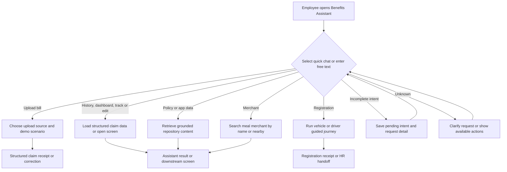
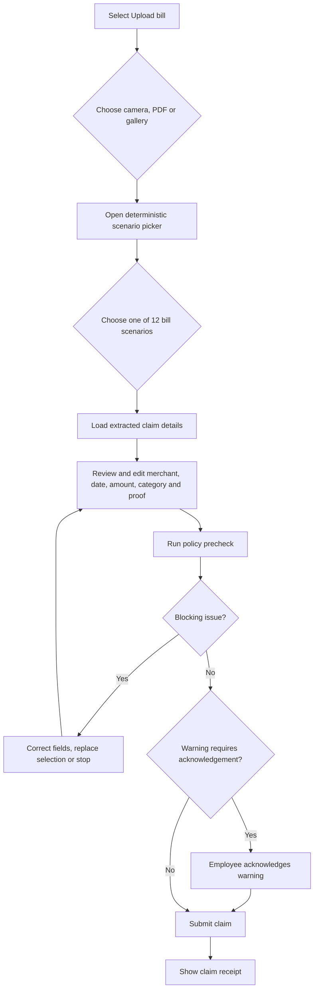
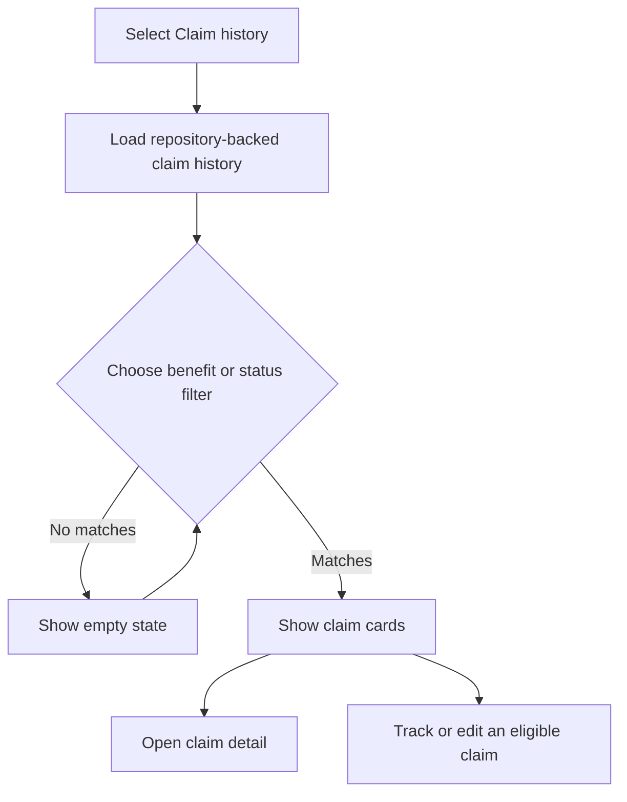
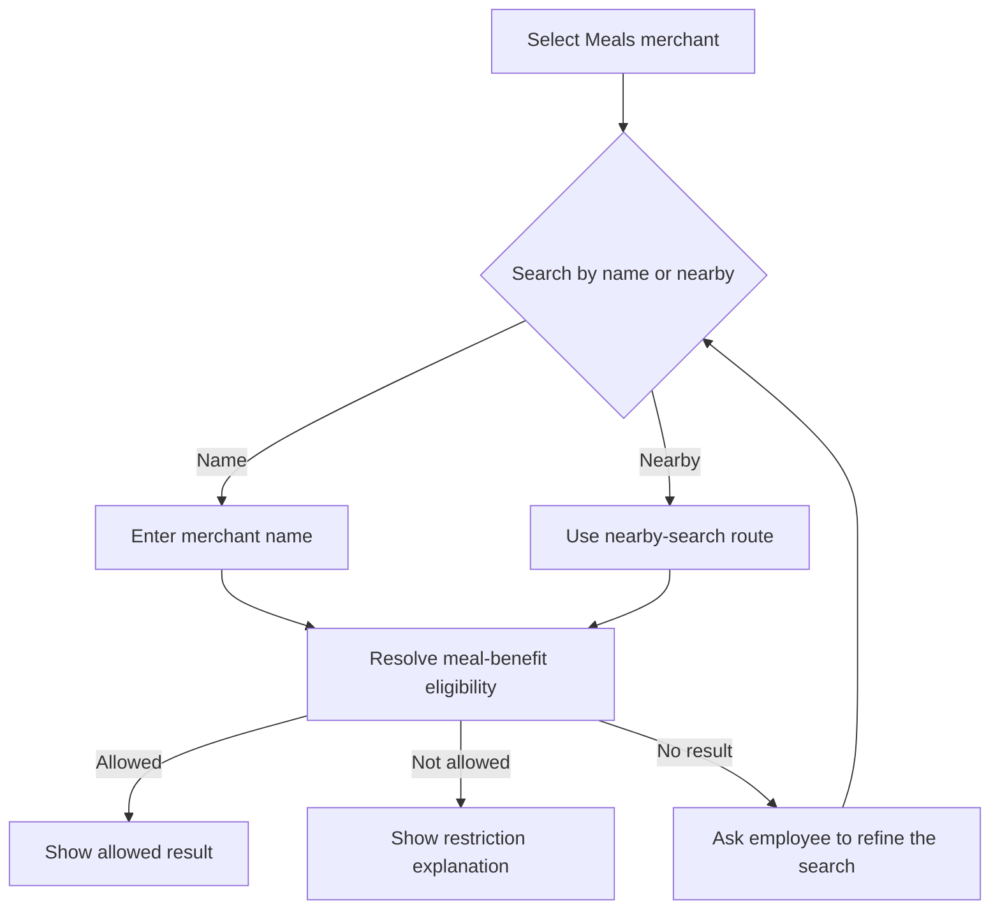
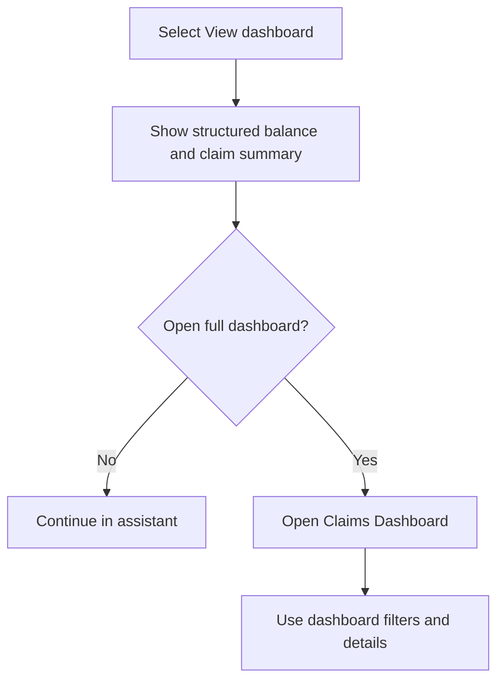
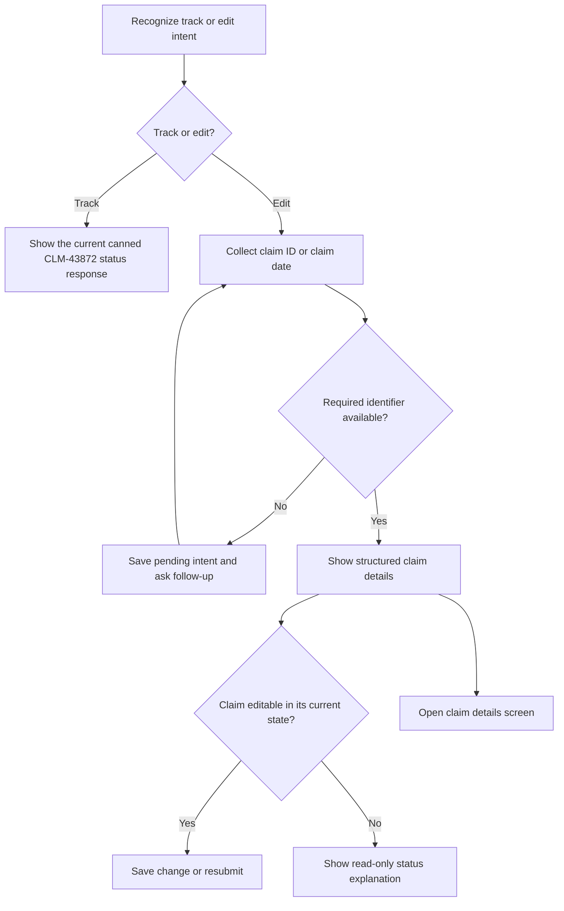
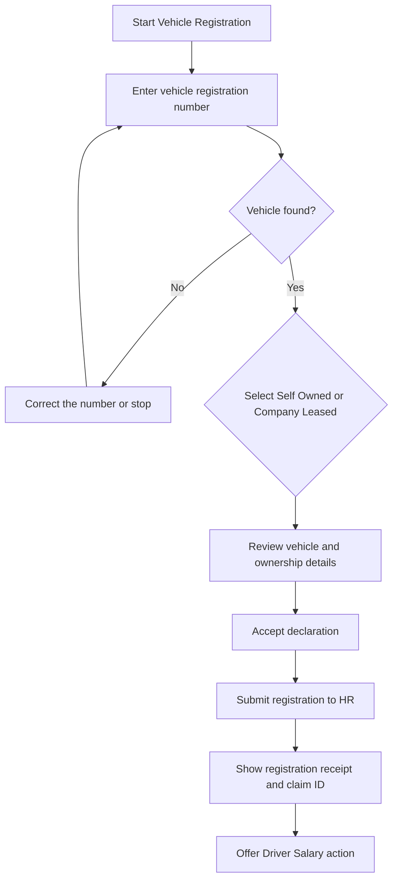
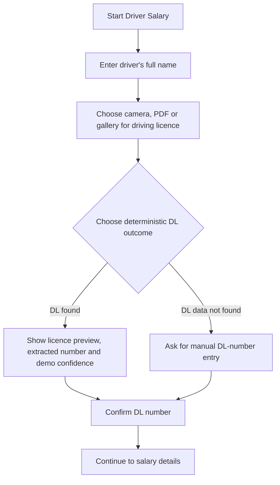
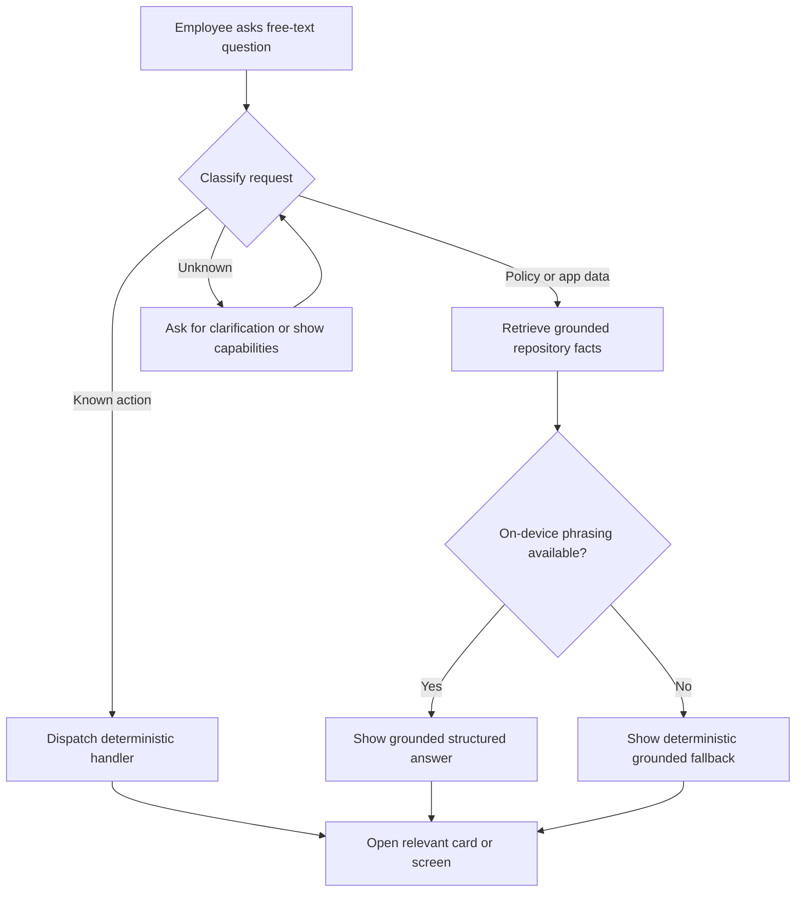
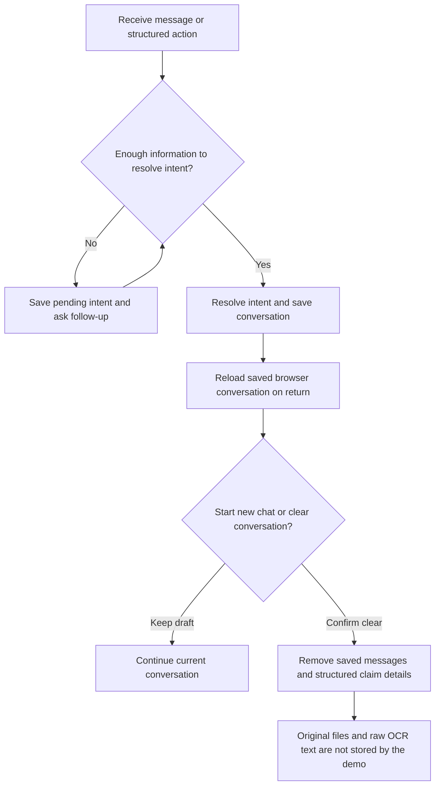

# Benefits Assistant Journey & Workflow — Current State

> Repository-backed product and UX reference for the EB+Claims Benefits Assistant as verified on 10 August 2026.


## Purpose

This document describes only behavior present in the current EB+Claims repository and deterministic local demo. It covers visible quick chats, guided registration journeys, free-text routing, bill scenarios, policy and application-data answers, persistence, privacy, statuses, errors, limitations, and downstream screen handoffs.

## Current entry points

The assistant exposes five visible quick chats:

- Upload bill
- Claim history
- Meals merchant
- View dashboard
- View policy

Additional routes are available through recommendations, structured cards, menu actions, and recognized free text:

- Track claim
- Edit claim
- Vehicle Registration
- Driver registration and Driver Salary
- Grounded policy and application-data questions
- New chat, saved conversation recovery, pending intents, and conversation clearing


## Master assistant journey



## 1. Upload bill

All three visible source choices open the deterministic scenario picker in the current demo. The repository contains extraction helpers, but the visible camera, PDF, and gallery choices do not pass a real device file into that processing path.




### Current precheck gates

- Required fields are present.
- Amount is positive.
- Bill date is available.
- Benefit and category match the policy data.
- Amount is within the available allowance.
- Required proof is present.
- Duplicate evidence is evaluated.
- Submission deadline is evaluated.
- Blocking issues prevent submission.
- Warnings can require explicit acknowledgement before submission.


### Twelve deterministic bill scenarios

| Scenario | Current precheck behavior | Employee path |
| --- | --- | --- |
| Meal Bill | Complete meal receipt | Review and submit |
| Meal Bill — missing data | Amount and date need attention | Edit fields and rerun precheck |
| Fuel Bill | Complete fuel receipt | Review and submit |
| Fuel Bill — exceeding balance | Amount exceeds available allowance | Correct amount or stop |
| Internet Bill | Monthly broadband invoice | Review and submit |
| Mobile Postpaid Bill | Monthly mobile invoice | Review and submit |
| Gift Bill | Festival gift purchase | Review and submit |
| Books & Periodicals | Professional book invoice | Review and submit |
| Professional Development | Role-related course invoice | Review and use the HR-review route when indicated |
| Duplicate Bill | Matches an existing claim | Acknowledge the duplicate warning before submission |
| Late Bill | Outside the submission window | Follow the warning or blocked result shown by the scenario |
| Other / HR Review | Category requires HR review | Accept the review route |

## 2. Claim history



Current behavior includes benefit and status filtering, matching claim cards, empty-filter recovery, and claim-detail handoff.

## 3. Meals merchant

The visible action is fixed to meal merchants. Search supports merchant-name lookup and a nearby branch. Results communicate allowed, not allowed, or no-result outcomes.




## 4. View dashboard



The assistant provides a compact summary and can hand the employee to the Claims Dashboard for deeper exploration.

## 5. View policy

```mermaid
flowchart TD
    A["Select View policy"] --> B{"Choose a benefit"]
    B --> C["Load grounded policy and application data"]
    C --> D{"On-device answer available?"}
    D -->|Yes| E["Show structured grounded answer"]
    D -->|No or delayed| F["Use deterministic grounded fallback"]
    E --> G["Open Policy details when requested"]
    F --> G
```

The route covers eligibility, allowance, deadlines, proof requirements, category rules, and process questions for the supported benefits. Repository-backed content remains available when the optional on-device answer path is unavailable.

## 6. Track and edit claim



Current limitation: the tracking response uses a canned claim rather than binding the employee-entered identifier to a live lookup.

## 7. Vehicle Registration



The deterministic lookup displays vehicle details, ownership selection, a declaration, an HR-submission state, a receipt, a vehicle-detail link, and a Driver Salary continuation.


Current limitation: the displayed owner name is hard-coded as Vishal Sharma in the vehicle lookup even when another persona context is active.

## 8. Driver registration and Driver Salary



The current demo includes two DL outcomes:

| Outcome | Current result |
| --- | --- |
| DL found | Shows a fictional licence preview, extracted DL number, and demo confidence for confirmation |
| DL data not found | Requests manual entry of the licence number |


## 9. Grounded policy and application-data routing



## 10. Persistence, pending intents, privacy, and clearing



The clear-conversation dialog states that it removes the current chat and structured claim details saved in the browser. It also states that original files and raw OCR text are not stored.

## Supported benefits

| Benefit | Current assistant coverage | Common exception |
| --- | --- | --- |
| Meal | Bill precheck, policy answer, merchant eligibility | Missing amount/date or ineligible merchant |
| Fuel & Maintenance | Bill precheck and policy routing | Allowance overrun or vehicle dependency |
| Internet | Broadband invoice extraction and precheck | Missing or unsupported proof |
| Mobile | Postpaid invoice extraction and precheck | Missing invoice fields |
| Gift | Gift-purchase extraction and precheck | Category or merchant mismatch |
| Books & Periodicals | Professional-book extraction and precheck | Non-professional category |
| Professional Development | Course-invoice extraction and precheck | Category ambiguity and HR review |

## Current claim-status vocabulary

Status labels present across the repository include:

- Submitted
- Policy checked
- Under review
- Needs info
- Approved
- Rejected
- Revoked
- Reimbursed
- Paid in one tracking explanation

The repository currently uses overlapping terms across assistant responses, cards, and downstream views.

## Error and recovery coverage

| Area | Current condition | Current employee action |
| --- | --- | --- |
| Bill details | Required value missing | Edit the structured field |
| Bill amount | Non-positive or above allowance | Correct the amount or stop |
| Bill date | Date absent or outside the scenario window | Correct or follow the displayed warning/block |
| Proof | Required evidence absent | Add or replace the selected proof |
| Duplicate | Existing-claim match | Acknowledge the warning before submission |
| Category | No direct policy match | Use the HR-review route |
| Claim filter | No matching history | Clear or change the filter |
| Merchant | Not allowed or not found | Read the explanation or refine the query |
| Vehicle lookup | Registration not found | Correct and retry |
| DL extraction | Licence number not found | Enter the number manually |
| Free text | Intent incomplete | Answer the stored follow-up prompt |
| Free text | Intent unknown | Clarify or choose an available action |
| On-device answer | Preparation unavailable or delayed | Receive grounded deterministic fallback content |

## Current downstream handoffs

| Assistant result | Destination |
| --- | --- |
| View dashboard | Claims Dashboard |
| View policy | Policy details |
| Claim history, track, or edit | Claim details |
| Vehicle registration receipt | Vehicle details |
| Vehicle submission | HR review state |
| Vehicle completion | Driver Salary guided journey |

## Current persona behavior

- The active persona supplies user context in several assistant and application surfaces.
- Vehicle lookup displays Vishal Sharma as the owner through hard-coded data.
- Persona-sensitive checks need to account for this fixed owner value when reviewing deterministic demo results.

## Verified current limitations

| ID | Limitation | Repository or demo evidence |
| --- | --- | --- |
| C-01 | Device upload is not connected to the visible journey | Camera, PDF, and Gallery all open deterministic scenario selection |
| C-02 | Track claim uses a canned identifier | Tracking responds with CLM-43872 rather than the entered claim identifier |
| C-03 | Vehicle owner is hard-coded | Vehicle review shows Vishal Sharma independent of active persona |
| C-04 | Merchant scope is inconsistent across dormant and visible elements | Visible quick chat is Meals merchant while other components describe broader merchant types |
| C-05 | Assistant journey stops at receipt or operational handoff | The demo does not persist verification, payment scheduling, or payment completion transitions |
| C-06 | On-device answer preparation can remain visible for an extended period | Policy capture remained in the preparation state during the deterministic review |
| C-07 | Capability descriptions exceed reachable UI in places | Some described components or actions are not connected to a visible entry point |
| C-08 | Status vocabulary overlaps | Paid/Reimbursed and pending/review language varies across surfaces |

## Repository evidence map

| Area | Primary source |
| --- | --- |
| Visible quick chats | `features/chat/constants.ts` |
| Routing, pending intents, persistence, vehicle and driver journeys | `features/chat/useChat.ts` |
| Twelve bill scenarios | `features/chat/demoUploadScenarios.ts` |
| Claims and status examples | `features/claims`, `features/claims-history`, and chat constants |
| Benefits and policy data | Policy, dashboard, persona, and benefit constants |

## Current-state verification checklist

- Five visible quick chats are represented.
- Track/edit, vehicle, driver, grounding, persistence, and clearing routes are represented.
- Seven benefit categories are covered.
- Twelve deterministic bill scenarios are listed.
- Both driving-licence outcomes are covered.
- Claim filters, merchant variants, persona behavior, errors, recovery actions, and screen handoffs are recorded.
- Current limitations are separated from implemented behavior.
